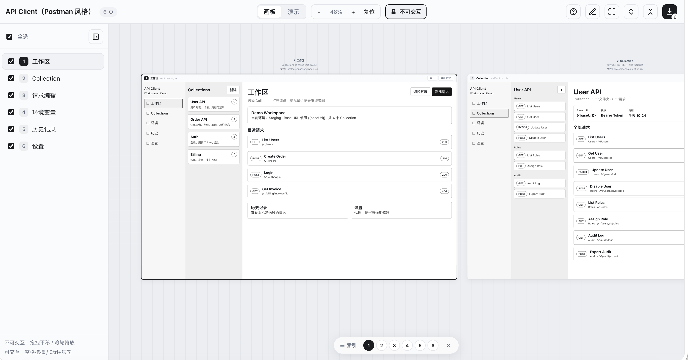
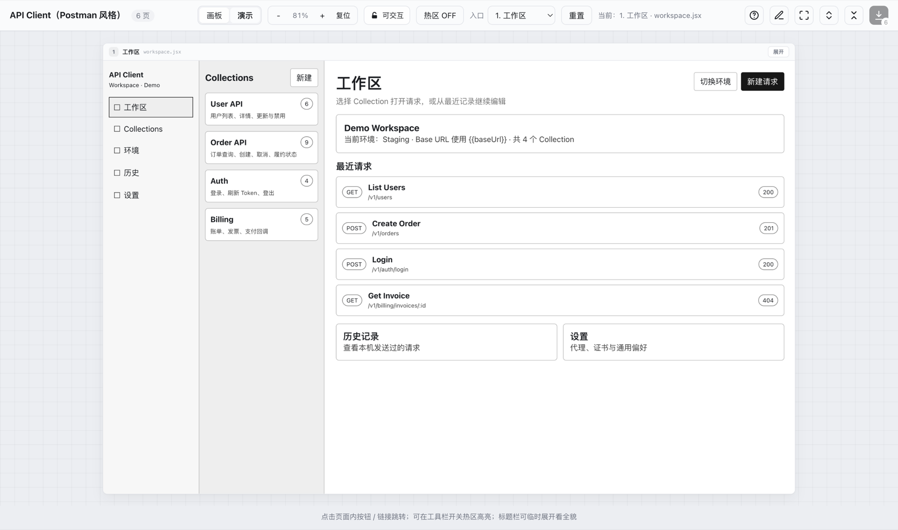
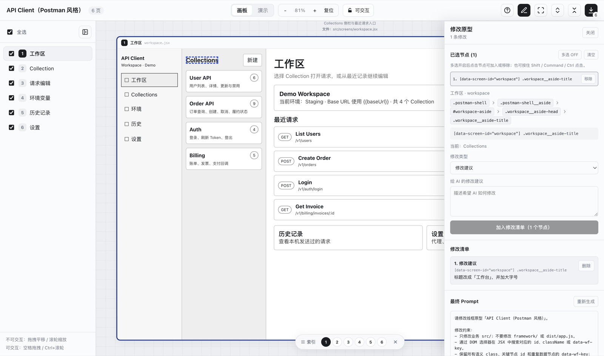
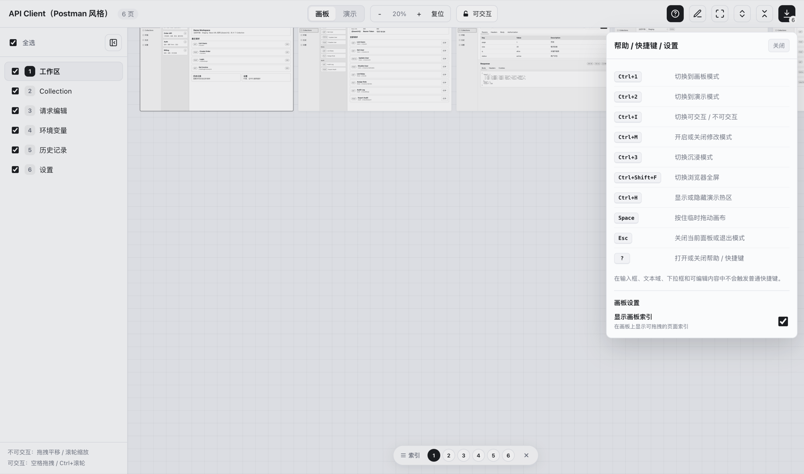
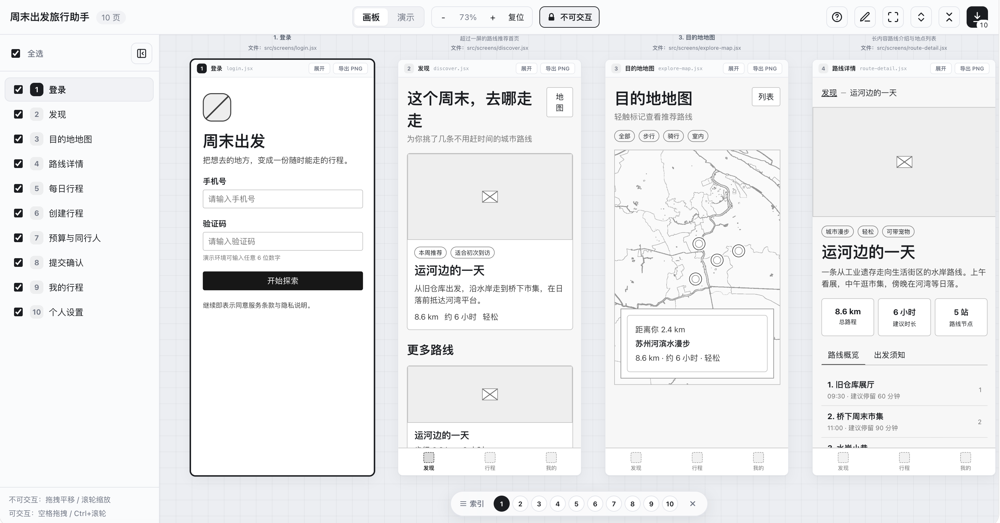
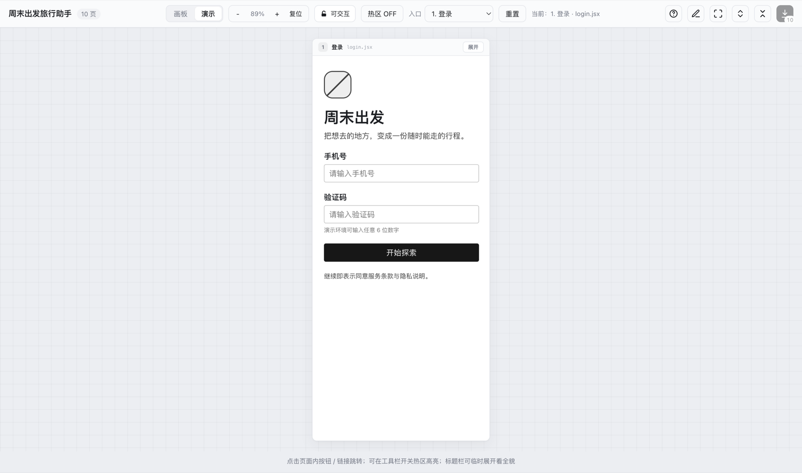

# Multi-Screen Wireframe

**Language:** [中文](README.md) | [English](README.en.md)

**Skill version: `2.1.0`** (see `VERSION`)

**Deliverable format: `vue-global@2`**

**Author:** [reaidea](https://reaidea.com/)

Generate **double-clickable**, AI-editable multi-screen wireframe prototypes from product requirements or visual references.

End-user board guide: **[User Guide](docs/user-guide.md)** ([中文](docs/使用说明.md)).

The v2 deliverable ships with business source, Vue 3 Global Build, the board, and export utilities. It needs no build step, Node.js, package manager, network, local server, or directory permission—edit business `.js` / CSS and refresh `index.html`.

## What it does

- **Multi-screen flows**: canvas overview + demo-mode navigation (`links` / `to`)
- **Desktop / mobile**: SideNav, TabBar, tables, forms, overlays, and other wireframe UI primitives
- **Grayscale wireframes**: geometric placeholder icons; measure-then-layout when references exist
- **Export**: single-page PNG or multi-page ZIP
- **Modify Prompt**: select one or many DOM nodes, mark them with yellow numbers, float-review comments, and generate an editable AI prompt
- **Page / module annotations**: blue markers with local autosave; edit, delete, import/export JSON, and batch-sync into prototype source
- **Help and shortcuts**: keyboard toggles for board, demo, interaction lock, modify, immersive, fullscreen, and hotspots; press `?` for the full list
- **UI language**: board chrome supports Simplified Chinese / Traditional Chinese / English; follows the browser by default, switchable in settings
- **Configurable index**: draggable canvas index that can be closed, with a per-project visibility preference
- **No build, keep editing**: business source split into plain `.js` screens; save and refresh the browser
- **Per-screen error isolation**: a failed screen shows an error card while other pages keep working

### Screenshots

Multi-screen board overview (desktop demo):



Demo-mode navigation:



Modify mode: select nodes, organize the change list, and generate a Prompt:



Help / shortcuts / settings and canvas index:



Mobile multi-screen board:



Mobile demo:



## Not for

- High-fidelity visual design systems
- Real backends, auth, or app routers
- Production Vue apps that need SFC, TypeScript, Vite, or npm packages
- A single static page with no multi-screen board

## v1 / v2 compatibility

| Deliverable | How to recognize | How to edit | Framework upgrade |
| --- | --- | --- | --- |
| v1 React/JSX | `.jsx`, `src/app.jsx`, build scripts, or `framework/tools/esbuild-*` | Read the deliverable's own `AGENTS.md` / `EDITING.md`, then rebuild | Use v1 framework only |
| v2 Vue Global | `project.formatVersion === 2` and `framework/FORMAT_VERSION` is `vue-global@2` | Edit plain `.js` / CSS, refresh the browser | Use `vue-global@2` framework only |

Updating the Skill does not mutate existing v1 deliverables. Never overlay a v2 framework onto a v1 project, and never casually rewrite a v1 project to Vue. An explicit migration must target a new directory and keep the original as rollback.

The final v1 React/JSX release is frozen at Git tag `v1.8.0`. v2 is the mainline from `v2.0.0` onward, with no runtime compatibility layer for old component APIs. Full breaking changes: [`CHANGELOG.md`](CHANGELOG.md).

## Layout

| Path | Role |
| --- | --- |
| `starter/` | Sole copy source: copy the whole directory when generating a prototype |
| `demo/` | Coverage examples (desktop / mobile), not a copy source |
| `docs/user-guide.md` | End-user board guide for product/design ([中文](docs/使用说明.md)) |
| `SKILL.md` | Generation, editing, format detection, and migration rules for AI agents |
| `reference.md` | Project, Vue factory, component, and annotation protocol |
| `AGENTS.md` | Repo maintenance boundaries and technical constraints |
| `framework-source/` | Board React/JSX maintenance source (not shipped); compiles to `starter/framework/runtime/board.js` |
| `scripts/` | Create and check a single deliverable |
| `tools/check.mjs` | Check the whole Skill, starter, and demos |
| `CHANGELOG.md` | Major versions and breaking changes |

## Install

This repo is an Agent Skill (`SKILL.md` at the root). Use any option below with a Skills-capable agent (Cursor, Claude Code, Codex, OpenCode, etc.).

### 1. Install with the Skills CLI (recommended)

Requires Node.js / npm:

```sh
# Install for the current project (can be committed and shared)
npx skills add ginuim/multi-screen-wireframe

# Install globally (available to all local projects)
npx skills add ginuim/multi-screen-wireframe -g

# Skip prompts; optionally target an agent such as cursor / claude-code / codex
npx skills add ginuim/multi-screen-wireframe -g -y
npx skills add ginuim/multi-screen-wireframe -a cursor -g -y
```

Or use the full repo URL:

```sh
npx skills add https://github.com/ginuim/multi-screen-wireframe
```

After install, use `npx skills check` / `npx skills update`. More: [skills CLI](https://github.com/vercel-labs/skills) and [skills.sh](https://skills.sh/).

### 2. Point the agent at the repo

Paste the repo URL into the chat and ask the agent to follow the Skill, for example:

> Please generate a multi-screen wireframe with this skill: https://github.com/ginuim/multi-screen-wireframe
> Read `SKILL.md` first, then copy `starter/` and edit only business `src/`.

Most Skills-capable / GitHub-reading agents will pull the conventions and generate the prototype.

### 3. Manual clone into a skills directory

```sh
git clone https://github.com/ginuim/multi-screen-wireframe.git
```

Place the clone in your tool's skills path (Cursor / Claude / Codex each have their own `skills` directory), or symlink it from a project.

For v1, install from the `v1.8.0` tag snapshot; do not copy framework from the v2 mainline onto a v1 deliverable.

## Generate a prototype

Confirm the output path → copy all of `starter/` → edit only business `src/` → open or refresh `index.html`.

With Node.js available, use the safe copy and static-check scripts:

```sh
node scripts/create-project.mjs /absolute/path/to/new-prototype
node scripts/check-project.mjs /absolute/path/to/new-prototype
```

These scripts are not a runtime dependency of the deliverable. Without Node.js, copy all of `starter/` and verify over `file://`.

## Edit a deliverable

In the deliverable directory, read first:

- `AGENTS.md`: format, allowed edit scope, and verification steps
- `EDITING.md`: full Vue Global screen authoring rules
- `COMPONENTS.md`: authoritative Wf component props, events, slots, and composition
- `src/screens/_template.js`: page template

Keep business edits in `src/`; change `index.html` only for page title or extra business CSS links. Do not modify `framework/` to work around business errors. Keep semantic classes on Vue template nodes, globally unique ids on critical nodes, and `data-wf-key` on repeated data nodes so Modify Prompt and annotation selectors stay stable.

Before upgrading framework, confirm `src/project.js` `format` / `formatVersion` and `framework/FORMAT_VERSION` are all `vue-global@2`. Overwrite `framework/` only within the same format and major; never overwrite `src/`.

## Modify to prompt

Traditional prototyping tools edit element content, style, and position directly. Here the UI is driven by AI-generated business source, so you cannot reverse the on-screen look into the right code change. Modify mode exists to pin DOM nodes precisely, generate a Prompt with stable selectors, and hand it to AI to edit `src/`.

Open the prototype and click **Modify** in the toolbar: click nodes inside a screen; the first hit is often the innermost child—use the breadcrumb to move to a parent. Enable **Multi-select** or hold Shift / Command / Ctrl while clicking to bind multiple nodes to one comment (for example, swap the order of two elements). Each comment shows the same translucent yellow number beside all targets; click the number to float-review it. Hold Space to pan the canvas temporarily, then release to keep modifying. The change list generates a Prompt you can edit further and copy to AI in one click.

Modify records live only in the current page session. They do not change business source and do not write extra state files. AI should search Vue templates in `src/screens/*.js` by the Prompt's id / class / `data-wf-key`; refresh `index.html` after editing source.

## Annotate and sync

Click **Annotate** in the toolbar to comment on a whole page or a selected in-screen module—notes, questions, and design decisions. Annotations use blue numbered markers; they can be edited or deleted and do not carry Todo / review status.

Annotations first autosave as an operation log in the current browser, with a pending-sync count. Click **Copy sync Prompt** and give it to AI to merge operations into `src/annotations.js` idempotently by stable id; after refresh, annotations ship with the prototype and Git. If browser local storage is unavailable, export annotation JSON immediately.

**Export annotation JSON** downloads `<project-id>.wireframe-annotations.json`, which can be imported and merged from another device or browser. Import is allowed only for the same project id, to avoid writing notes into the wrong prototype. JSON is for cross-device exchange and backup, not a daily required step.

## Shortcuts and board settings

On macOS, use `Ctrl+1` / `Ctrl+2` for board and demo, `Ctrl+I` for interaction lock, and `Ctrl+M` for modify mode; on Windows/Linux use `Alt+1` / `Alt+2`, `Alt+I`, and `Alt+M`. Browser fullscreen uses the platform modifier plus `Shift+F`; immersive mode uses the platform modifier plus `3`; zoom with `Ctrl+wheel`. Hold `Space` to pan temporarily, press `Esc` to close the current panel or exit a mode, and press `?` for Help / Shortcuts. Inputs and editable content ignore ordinary shortcuts; the immersive toolbar also exposes help and settings.

The bottom canvas index can be dragged by its handle or closed. Re-enable it under **Help → Show canvas index**; **Show annotation markers by default** controls whether blue markers appear during normal browsing (annotation mode still shows them temporarily when off). Visibility is stored per project in the browser; drag position lasts only for the current session. The same panel switches UI language (Simplified Chinese / Traditional Chinese / English); the language preference is global on the machine and separate from project settings.

## Run

Double-click `index.html` in the deliverable directory. The page loads the local Vue compiler, Wf UI, precompiled Board, and multi-file business source over `file://`; no build command is required.

## Demo

Open these (they must resolve the shared `starter/`):

- `demo/api-client/index.html` — desktop API Client (6 screens: SideNav, DataTable, Tabs, forms); see board / demo / modify screenshots above
- `demo/travel-app/index.html` — mobile travel assistant (10 screens: long pages, map, TabBar, full forms, overlays, feedback); see mobile screenshots above

Demos are for coverage only; `../../starter/framework/` is an in-repo test path. When generating a user prototype, copy the full `starter/`—do not copy a demo `index.html`.

Maintainer check for the whole v2 Skill:

```sh
node scripts/check-project.mjs starter
node tools/check.mjs
```

## For AI agents

Follow `SKILL.md`: detect the deliverable format → confirm the output path → copy `starter/` → edit only business `src/` → verify canvas, demo mode, viewports, navigation, modify, and annotations through `index.html`. See `reference.md` for the project schema and the deliverable's `COMPONENTS.md` for the public UI contract.

## Platforms

The deliverable ships Vue 3 Global Build, the React / ReactDOM Board, and local export libraries. Versions and licenses live under `starter/framework/vendor/`. It contains no esbuild, WASM, Node runtime, or platform-specific binary and runs in modern desktop browsers that allow local `file://` scripts.

## Author

Maintained by [reaidea](https://reaidea.com/). More projects and writing: [reaidea.com](https://reaidea.com/).
